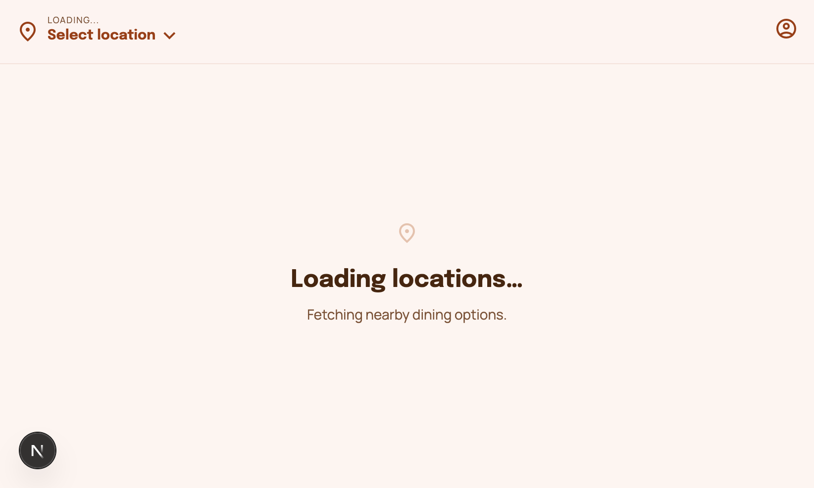
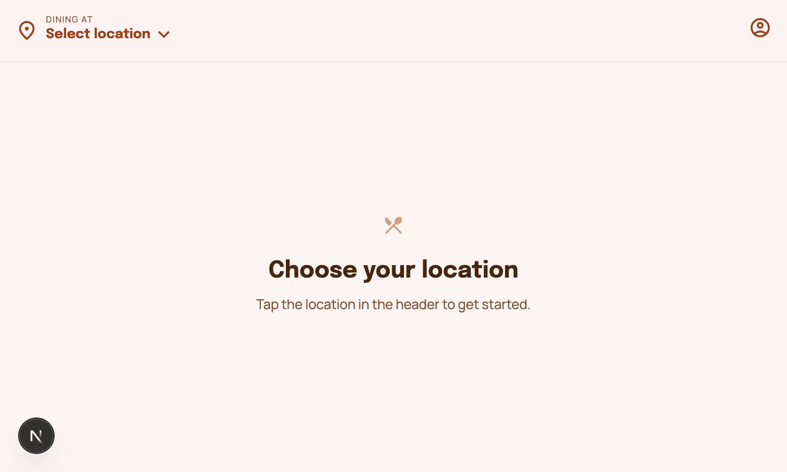

# Per Diem — Square Menu (Full Stack)

Mobile-friendly web app that proxies the Square API on the backend and renders a restaurant menu on the frontend.

## Tech stack
- **Backend**: Express + TypeScript, direct HTTPS calls to Square, in-memory cache with optional Redis/Upstash
- **Frontend**: Next.js (App Router) + TypeScript + Tailwind
- **Testing**: Vitest (unit/component), Supertest (backend HTTP), Playwright (frontend e2e)

## Repo layout
- `[backend/](backend/)`: Square proxy API (`/api/*`)
- `[frontend/](frontend/)`: menu UI (single page)
- `docker-compose.yml`: **backend + redis** (frontend runs locally)

## Requirements mapping
See `[COMPLIANCE_CHECKLIST.md](COMPLIANCE_CHECKLIST.md)` for a requirement-by-requirement checklist with evidence links.

## Setup

### 1) Environment variables

Backend:
- Copy `[backend/.env.example](backend/.env.example)` → `backend/.env`
- Required:
  - `SQUARE_ACCESS_TOKEN`
  - `SQUARE_ENVIRONMENT` (`sandbox` recommended)

Frontend:
- Copy `[frontend/.env.example](frontend/.env.example)` → `frontend/.env`
- `NEXT_PUBLIC_API_URL` should point at the backend (`http://localhost:8080/api` by default)
- **Node**: frontend expects **Node >= 20.9** (Next.js 16). Backend works on Node 18+.

### 2) Install dependencies

```bash
cd backend && npm install
cd ../frontend && npm install
```

### 3) Run (local dev)

In two terminals:

```bash
cd backend && npm run dev
```

```bash
cd frontend && npm run dev
```

Open the app at `http://localhost:3000`.

## Architecture decisions and trade-offs

### Backend
- **Square API access via direct HTTPS**: avoids SDK dependency/weight and keeps the proxy explicit. Trade-off: more manual response/error mapping.
- **Two-tier cache (optional)**:
  - In-memory TTL cache as the default (zero deps, always works).
  - Optional Redis (local) or Upstash (HTTP) when configured. Trade-off: Redis introduces connection management and operational complexity; Upstash avoids connections but adds an external dependency and slightly higher latency per request.
- **Catalog snapshot reuse**: a single cached `catalog_snapshot:<locationId>` is shared by `/catalog` and `/catalog/categories` to avoid duplicate Square calls. Trade-off: snapshot is a bit more complex than caching each endpoint independently, but reduces upstream load.
- **Error shaping**: errors return `{ error, code }` so the frontend can render better retry states without leaking sensitive details.

### Frontend
- **App Router + client-side data fetching**: keeps interaction snappy (location selection, search, category scrolling). Trade-off: relies on API availability at runtime; mitigated with clear loading/error states and retry.
- **Currency-aware pricing**: uses `Intl.NumberFormat` when currency is available; falls back to a simple `$` format.

## API

The backend exposes:
- `GET /api/locations`: active locations (simplified + typed)
- `GET /api/catalog?location_id=...`: items grouped by category for that location (paginates transparently)
- `GET /api/catalog/categories?location_id=...`: categories with `item_count` for that location

## Caching
- Default: **in-memory TTL cache**
- Optional:
  - **Redis**: set `REDIS_URL` (used by `docker-compose.yml`)
  - **Upstash Redis**: set `UPSTASH_REDIS_REST_URL` + `UPSTASH_REDIS_REST_TOKEN`

## Error handling
- Backend maps Square errors into a clean `{ error, code }` response (no access token exposed).
- Frontend surfaces retryable error states.

## Tests

Backend:

```bash
cd backend && npm test
```

Frontend unit/component:

```bash
cd frontend && npm test
```

Frontend e2e (Playwright):

```bash
cd frontend && npm run test:e2e
```

Notes:
- Playwright e2e runs the UI against a **mock API** by default (fast + deterministic).
## Docker (bonus)

Starts **redis + backend**:

```bash
docker compose up --build
```

Then run the frontend locally (`cd frontend && npm run dev`) and use `NEXT_PUBLIC_API_URL=http://localhost:8080/api`.

## Assumptions / limitations
- Square integration uses direct HTTPS (not the official SDK) to keep dependencies light.
- E2E tests validate UI flows via a mock API; backend integration is covered via unit + Supertest HTTP tests.

## Screenshots / demo

- **Loom video (optional)**: add your Loom link here: `https://www.loom.com/share/<id>`

Screenshots (local run):


